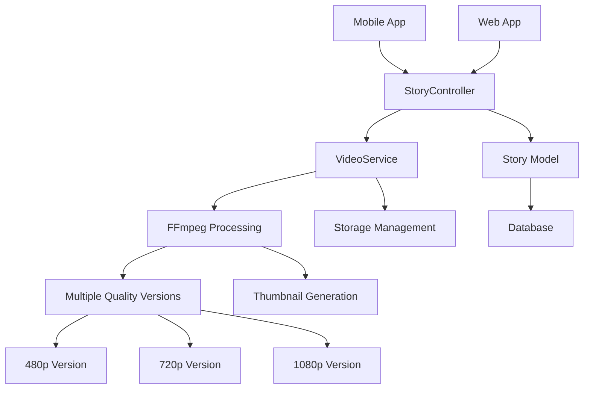

# Design Document

## Overview

Данный дизайн описывает интеграцию существующей системы оптимизации видео в функциональность историй (Stories). Основная цель - переиспользовать проверенную логику VideoService для обеспечения быстрой загрузки, экономии трафика и улучшенного пользовательского опыта при работе с видео в историях.

## Architecture

### Компоненты системы



### Архитектурные принципы

1. **Переиспользование кода**: Максимальное использование существующего VideoService
2. **Асинхронная обработка**: Видео обрабатывается в фоновом режиме
3. **Прогрессивная загрузка**: Пользователь может просматривать историю до завершения оптимизации
4. **Адаптивное качество**: Автоматический выбор качества на основе условий сети

## Components and Interfaces

### 1. StoryController (Модификации)

**Новые методы:**
- `storeWithVideoOptimization()` - создание истории с оптимизацией видео
- `getVideoQualityVersions()` - получение доступных версий качества
- `updateVideoProcessingStatus()` - обновление статуса обработки

**Модификации существующих методов:**
- `store()` - интеграция с VideoService для видео файлов
- `show()` - возврат информации о доступных версиях качества

### 2. VideoService (Расширения)

**Новые методы:**
- `uploadStoryVideo()` - специализированная загрузка для историй
- `createMultipleQualityVersions()` - создание версий 480p, 720p, 1080p
- `getOptimalQualityForConnection()` - выбор качества на основе скорости соединения
- `generateStoryThumbnail()` - создание превью для историй (квадратный формат)

**Конфигурация для историй:**
```php
protected array $storySettings = [
    'max_duration' => 60, // секунд
    'thumbnail_size' => '320x320', // квадратный формат
    'qualities' => [
        '480p' => ['width' => 480, 'height' => 854, 'bitrate' => '500k'],
        '720p' => ['width' => 720, 'height' => 1280, 'bitrate' => '1000k'],
        '1080p' => ['width' => 1080, 'height' => 1920, 'bitrate' => '2000k']
    ]
];
```

### 3. Story Model (Расширения)

**Новые поля:**
```php
protected $fillable = [
    // ... существующие поля
    'video_480p',           // путь к версии 480p
    'video_720p',           // путь к версии 720p  
    'video_1080p',          // путь к версии 1080p
    'video_thumbnail',      // путь к превью
    'processing_status',    // статус обработки: pending, processing, completed, failed
    'original_video_size',  // размер оригинального файла
    'optimized_video_size', // размер оптимизированной версии
    'compression_ratio',    // коэффициент сжатия
    'video_duration'        // длительность видео в секундах
];
```

**Новые методы:**
```php
public function getOptimalVideoUrl(string $quality = 'auto'): ?string
public function isVideoProcessed(): bool
public function getVideoProcessingProgress(): int
public function getAvailableQualities(): array
```

### 4. Queue Jobs

**StoryVideoOptimizationJob:**
```php
class StoryVideoOptimizationJob implements ShouldQueue
{
    public function handle(VideoService $videoService): void
    {
        // 1. Создание версий разного качества
        // 2. Генерация превью
        // 3. Обновление модели Story
        // 4. Отправка уведомления о завершении
    }
}
```

## Data Models

### Story Model Extensions

```php
// Миграция для добавления полей оптимизации видео
Schema::table('stories', function (Blueprint $table) {
    $table->string('video_480p')->nullable();
    $table->string('video_720p')->nullable();
    $table->string('video_1080p')->nullable();
    $table->string('video_thumbnail')->nullable();
    $table->enum('processing_status', ['pending', 'processing', 'completed', 'failed'])
          ->default('pending');
    $table->bigInteger('original_video_size')->nullable();
    $table->bigInteger('optimized_video_size')->nullable();
    $table->decimal('compression_ratio', 5, 2)->nullable();
    $table->integer('video_duration')->nullable();
    $table->timestamp('processing_started_at')->nullable();
    $table->timestamp('processing_completed_at')->nullable();
});
```

### Configuration Model

```php
// config/video.php - расширение конфигурации
'stories' => [
    'max_file_size' => 50 * 1024 * 1024, // 50MB
    'max_duration' => 60, // секунд
    'allowed_formats' => ['mp4', 'mov', 'avi', 'mkv'],
    'thumbnail_format' => 'jpg',
    'thumbnail_size' => '320x320',
    'auto_delete_original' => true,
    'qualities' => [
        '480p' => [
            'width' => 480,
            'height' => 854,
            'bitrate' => '500k',
            'crf' => 28
        ],
        '720p' => [
            'width' => 720, 
            'height' => 1280,
            'bitrate' => '1000k',
            'crf' => 26
        ],
        '1080p' => [
            'width' => 1080,
            'height' => 1920,
            'bitrate' => '2000k',
            'crf' => 24
        ]
    ]
]
```

## Error Handling

### Стратегии обработки ошибок

1. **Ошибки загрузки:**
   - Валидация размера и формата файла
   - Проверка доступного места на диске
   - Откат к оригинальному файлу при ошибке оптимизации

2. **Ошибки обработки:**
   - Retry механизм для временных сбоев
   - Логирование детальной информации об ошибках
   - Уведомление пользователя о статусе обработки

3. **Ошибки воспроизведения:**
   - Fallback к более низкому качеству
   - Кэширование информации о доступных версиях
   - Graceful degradation для медленных соединений

### Обработка таймаутов

```php
// Конфигурация таймаутов
'processing_timeout' => 300, // 5 минут на обработку
'retry_attempts' => 3,
'retry_delay' => 60, // секунд между попытками
```

## Testing Strategy

### Unit Tests

1. **VideoService Tests:**
   - Тестирование создания версий разного качества
   - Проверка генерации превью для историй
   - Валидация настроек оптимизации

2. **Story Model Tests:**
   - Тестирование новых методов модели
   - Проверка статусов обработки
   - Валидация связей с файлами

3. **StoryController Tests:**
   - Тестирование API endpoints
   - Проверка загрузки видео
   - Валидация ответов API

### Integration Tests

1. **End-to-End Video Processing:**
   - Полный цикл загрузки и оптимизации
   - Проверка создания всех версий качества
   - Тестирование уведомлений

2. **API Integration:**
   - Тестирование мобильного API
   - Проверка адаптивного выбора качества
   - Валидация производительности

### Performance Tests

1. **Load Testing:**
   - Одновременная обработка множества видео
   - Тестирование под нагрузкой
   - Мониторинг использования ресурсов

2. **Quality Assessment:**
   - Сравнение качества сжатия
   - Измерение времени обработки
   - Анализ экономии места

## Implementation Phases

### Phase 1: Core Integration
- Расширение VideoService для историй
- Модификация Story модели
- Базовая интеграция в StoryController

### Phase 2: Quality Optimization
- Реализация множественных версий качества
- Адаптивный выбор качества
- Улучшенная генерация превью

### Phase 3: Performance & UX
- Асинхронная обработка через очереди
- Прогрессивная загрузка
- Мониторинг и аналитика

### Phase 4: Advanced Features
- Предиктивное кэширование
- Интеллектуальное сжатие
- A/B тестирование настроек оптимизации

## Security Considerations

1. **File Validation:**
   - Строгая проверка MIME типов
   - Сканирование на вредоносный код
   - Ограничения по размеру и длительности

2. **Access Control:**
   - Авторизация для загрузки видео
   - Проверка прав доступа к файлам
   - Rate limiting для API endpoints

3. **Storage Security:**
   - Безопасное хранение файлов
   - Регулярная очистка временных файлов
   - Шифрование чувствительных данных

## Monitoring and Analytics

### Метрики производительности
- Время обработки видео
- Коэффициенты сжатия
- Использование дискового пространства
- Частота ошибок обработки

### Пользовательские метрики
- Время загрузки историй
- Качество воспроизведения
- Частота переключения качества
- Пользовательские предпочтения качества